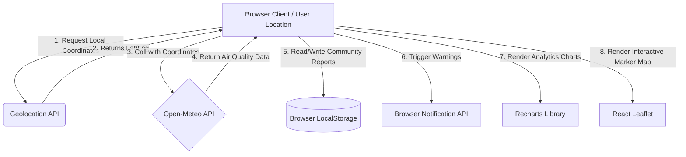

# 🌍 Pollution Control Hub

> A smart, community-focused web application designed to monitor real-time air pollution, translate complex environmental data into clear health recommendations, and empower citizens to advocate for cleaner cities.

---

<p align="center">
  
  
  
  
  
</p>

---


## 🚀 Why This Project

Urban air pollution is a silent crisis affecting millions of lives daily. While raw Air Quality Index (AQI) values are accessible, they are often hard to interpret and lack direct action paths for average citizens.

**Pollution Control Hub** bridges this gap by:
1. **Visualizing Complex Data:** Transforming raw telemetry (PM2.5, PM10, CO, NO2, Ozone) into intuitive, color-coded components.
2. **Contextualizing Health Risks:** Providing direct medical advisories and customized prevention tips based on real-time exposure.
3. **Fostering Community Action:** Creating a crowd-sourced mapping network where residents flag local pollution events, upload evidence, and mobilize local remediation efforts.

---

## ✨ Key Features

### 📊 Real-Time AQI Analytics
- **Live Dashboard:** Dynamically fetches and updates local AQI levels using the Open-Meteo Air Quality API.
- **Pollutant Breakdown:** Monitors and tracks specific particulates and gaseous elements:
  - **PM2.5 / PM10:** Respiratory health threats.
  - **NO2 / Ozone:** Traffic and industrial exhaust indicators.
  - **Carbon Monoxide (CO):** Incomplete combustion risks.
- **Compare Cities:** Multi-city graphical comparison interface built on React-Recharts.

### 📍 Interactive Geospatial Mapping
- **Hotspot Map:** Built on Leaflet maps with real AQI-sampled markers. A 3×3 grid of coordinates is queried around the user's location via Open-Meteo, and the top hotspots are ranked and labeled by cardinal direction (e.g. "North-East zone").
- **Geolocation Support:** Automatically pins the user's location to center calculations and alerts on nearest hotspots.
- **Grid Result Caching:** Nearby grid results are cached for 5 minutes to avoid redundant API calls on rapid refreshes.

### 🔔 Smart Alert Notification System
- **Exceedance Alerts:** Prompts immediate browser push notifications when local AQI exceeds configured threshold limits.
- **Exposure Timer:** Simple tracking indicator advising how long it is safe to remain outdoors based on current concentrations.

### 🩺 Health & Prevention Advisories
- **Custom Tips:** Automated medical advice (masks, air purifiers, outdoor exercise bans) tailored for children, elderly, asthmatics, and general population.
- **Policy Watch:** Highlights environmental legislation and citizen-rights policies under relevant domestic acts.

### 🤝 Community Crowdsourced Reports
- **Flag & Upload:** Users can report local pollution events (construction dust, trash burning, vehicle exhaust) with images, location tags, and descriptions.
- **Upvote Network:** Community upvotes elevate verified reports to prioritize city action (stored locally in `localStorage`).

---

## 🗺️ System Architecture & Data Flows



---

## 🧰 Tech Stack

| Component | Technology | Rationale |
| :--- | :--- | :--- |
| **Framework** | **React (Vite)** | Blazing fast development server and optimized build size. |
| **Styling** | **Tailwind CSS** | Responsive layouts, harmonized dark-mode support, and modern UI elements. |
| **Mapping** | **React Leaflet** | High-performance open-source mapping overlay without paid API requirements. |
| **Charts** | **Recharts** | Declarative chart components natively aligned to React hooks state. |
| **Data Source** | **Open-Meteo API** | Non-commercial open access air quality indices with hourly resolutions. |

---

## 🔌 API Integrations

The application communicates directly with the **Open-Meteo Air Quality API** to receive hourly forecasts and real-time conditions.

### Sample API Request
```bash
https://air-quality-api.open-meteo.com/v1/air-quality?latitude=52.52&longitude=13.41&hourly=pm2_5,pm10,nitrogen_dioxide,sulphur_dioxide,ozone,carbon_monoxide,us_aqi
```

### Sample Response Handler
```javascript
const fetchAirQuality = async (lat, lng) => {
  const response = await fetch(
    `https://air-quality-api.open-meteo.com/v1/air-quality?latitude=${lat}&longitude=${lng}&hourly=pm2_5,pm10,nitrogen_dioxide,ozone,carbon_monoxide,us_aqi&current=us_aqi`
  );
  if (!response.ok) throw new Error("Failed to retrieve air quality telemetry");
  const data = await response.json();
  return {
    currentAqi: data.current.us_aqi,
    pollutants: data.hourly,
  };
};
```

---

## 🖥️ Run Locally

Follow these steps to spin up the local development server:

1. **Clone the Repository:**
   ```bash
   git clone https://github.com/your-username/pollution-control-hub.git
   cd pollution-control-hub
   ```

2. **Install Dependencies:**
   ```bash
   npm install
   ```

3. **Launch the Development Server:**
   ```bash
   npm run dev
   ```

4. **Open in Browser:**
   Navigate to [http://localhost:5173](http://localhost:5173).

---

## ⚙️ Environment Variables & Config

By default, the application is zero-config. If deploying to production or staging, you can configure the following variables in a `.env` file at the root:

```env
# Notification Threshold (US AQI Scale 0-500)
VITE_ALERT_THRESHOLD=100

# Default Location Fallback (e.g., London coordinates)
VITE_DEFAULT_LAT=51.5074
VITE_DEFAULT_LNG=-0.1278
```

---

## 📍 Notes & Permissions

- **Location Services:** The app prompts for browser geolocation permissions on load. Denying permission falls back to default coordinates.
- **Push Alerts:** Exceedance alerts require browser permission. A setup banner prompts the user to enable them during initialization.
- **Data Persistence:** All custom community reports and voting state are sandboxed inside browser-isolated `localStorage` keys.

---

## 🌟 Vision

Our vision is to move citizens **from awareness to environmental action**. By combining live global telemetry, user-powered crowdsourced verification maps, and immediate health tips, we seek to inspire positive community policy reforms and cleaner urban living.

---

## 📄 License

Distributed under the MIT License. See [LICENSE](LICENSE) for more information.
